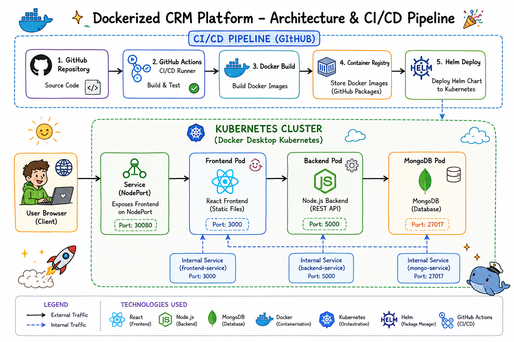
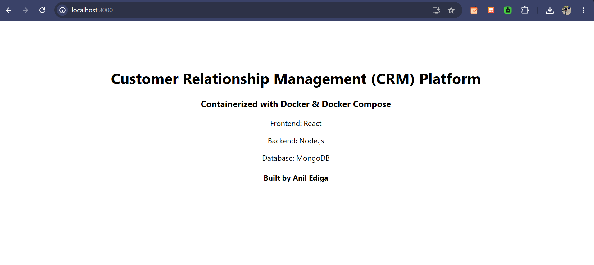
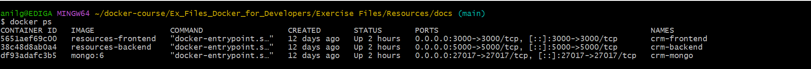
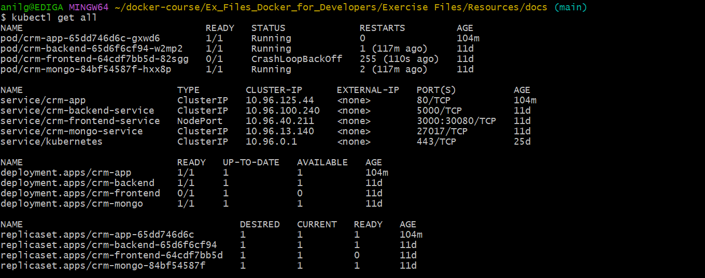
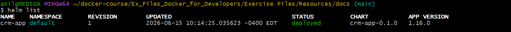

# 🚀 Dockerized CRM Platform


---

# 📖 Project Overview

The **Dockerized CRM Platform** is a full-stack application built to demonstrate modern DevOps practices using containerization, orchestration, and CI/CD.

The application consists of:

* React Frontend
* Node.js Backend API
* MongoDB Database

The project demonstrates how a multi-tier application can be:

* Containerized using Docker
* Orchestrated using Docker Compose
* Deployed using Kubernetes
* Packaged using Helm
* Automated using GitHub Actions

---

# 🎯 Business Problem

Organizations often struggle to deploy applications consistently across development, testing, and production environments.

Common challenges include:

* Environment inconsistencies
* Dependency conflicts
* Manual deployment errors
* Longer release cycles

This project demonstrates how Docker and Kubernetes help deliver repeatable, scalable, and automated deployments.

---

# 🏗️ Architecture

```text
                 +-------------------+
                 |   GitHub Repo     |
                 +---------+---------+
                           |
                    GitHub Actions
                           |
                    Build Docker Images
                           |
      +--------------------+--------------------+
      |                                         |
Docker Compose                          Kubernetes + Helm
      |                                         |
      +--------------------+--------------------+
                           |
                    React Frontend
                           |
                    Node.js Backend
                           |
                       MongoDB
```

Architecture Diagram



---

# 🛠️ Technology Stack

## Frontend

* React

## Backend

* Node.js
* Express

## Database

* MongoDB

## DevOps

* Docker
* Docker Compose
* Kubernetes
* Helm
* GitHub Actions
* Git
* Linux

---

# 📁 Project Structure

```text
backend/
frontend/
helm/
k8s/
docs/
README.md
docker-compose.yml
```

---

# ✨ Key Features

* Multi-container application architecture
* Docker containerization
* Docker Compose orchestration
* Kubernetes deployment
* Helm chart packaging
* GitHub Actions CI/CD pipeline
* Mobile and desktop accessibility

---

# 🚀 Running the Project

## Clone Repository

```bash
git clone https://github.com/aegoud/dockerized-crm-platform.git
cd dockerized-crm-platform
```

## Docker Compose

```bash
docker compose build
docker compose up -d
```

Verify containers:

```bash
docker ps
```

---

# ☸️ Kubernetes Deployment

Deploy:

```bash
kubectl apply -f k8s/
```

Verify:

```bash
kubectl get all
```

---

# ⚓ Helm Deployment

Install Helm chart:

```bash
helm install crm-app ./helm
```

Verify:

```bash
helm list
```

---

# 🔄 CI/CD

GitHub Actions is used to automate the build workflow.

Current pipeline:

* Source code validation
* Docker image build
* Workflow automation

---

# 📷 Project Screenshots

## Application



---

## Docker Containers



---

## Kubernetes Deployment



---

## Helm Deployment



---

# 🛠️ Challenges Solved

## MongoDB Connectivity

**Issue**

Backend failed to connect to MongoDB.

**Error**

```text
ENOTFOUND mongo
```

**Resolution**

Configured Docker Compose networking and MongoDB service discovery.

---

## React Runtime Compatibility

**Issue**

React application failed with:

```text
ERR_OSSL_EVP_UNSUPPORTED
```

**Resolution**

Updated the frontend runtime to a compatible Node.js version.

---

## Kubernetes Image Pull

**Issue**

```text
ErrImageNeverPull
```

**Resolution**

Corrected image configuration and validated image availability.

---

# 📚 Learning Outcomes

Through this project I gained practical experience with:

* Docker containerization
* Docker Compose orchestration
* Kubernetes Deployments
* Kubernetes Services
* Helm chart management
* GitHub Actions CI/CD
* Container networking
* Troubleshooting deployment issues

---

# 🚀 Future Enhancements

* User Authentication
* JWT Token-based Security
* Customer CRUD Operations
* Role-Based Access Control
* AWS Deployment (EC2 / EKS)
* Infrastructure as Code (AWS CDK / Terraform)
* Monitoring with Prometheus & Grafana
* Centralized Logging
* GitOps using ArgoCD

---

# 👨‍💻 Author

**Anil Ediga**
DevOps • Docker • Kubernetes • Helm • GitHub Actions • AWS • CI/CD
